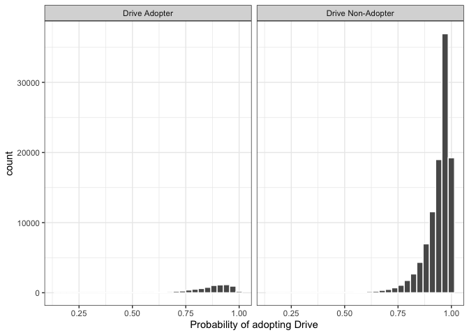
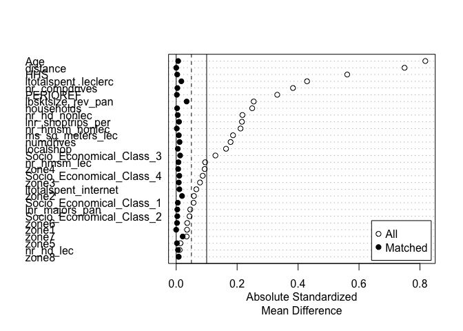
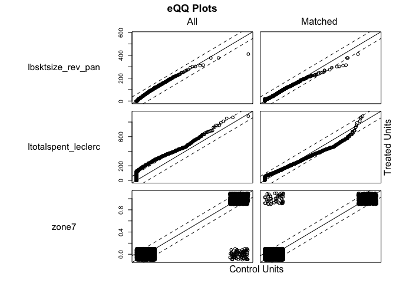

Homework 6
================
Carlos Siri
3/22/2021

## Introduction

*Does adoption change the spending behavior at the focal retailer?*

To secure their piece of the online grocery pie, many retailers are
rushing into the click and collect (Drive) format, where shoppers place
orders online and pick up the goods themselves later. We want to study
how the adoption of such a concept changes consumers’ spending at the
focal retailer (French retailer Leclerc) who opened the Drive format

This exercise shows the steps of adopting the “Drive” (Treated), as
opposed to not adopting (Control), on consumer spending. Propensity
score matching is used to match adopters with non-adopters.

# 1\. Pre-Analysis

## 1.1 Difference-in-means: Share of Wallet

The following table shows the differences in means of share of wallet
for the independent variable of interest (nonadopter), which classifies
panelists who adopted (1) and those who did not adopt adopted (0).

``` r
homework1 %>%
  group_by(nonadopter) %>%
  summarise(n_panelmembers = n(),
            mean_sow = mean(sow_before),
            std_error = sd(sow_before) / sqrt(n_panelmembers))
```

    ## `summarise()` ungrouping output (override with `.groups` argument)

    ## # A tibble: 2 x 4
    ##   nonadopter n_panelmembers mean_sow std_error
    ##   <fct>               <int>    <dbl>     <dbl>
    ## 1 0                    7737    0.357  0.00386 
    ## 2 1                  105997    0.187  0.000888

There is statistical significance in the difference in means of the
share of wallet for the interest variable.

``` r
with(homework1, t.test(sow_before ~ nonadopter))
```

    ## 
    ##  Welch Two Sample t-test
    ## 
    ## data:  sow_before by nonadopter
    ## t = 42.935, df = 8576.9, p-value < 2.2e-16
    ## alternative hypothesis: true difference in means is not equal to 0
    ## 95 percent confidence interval:
    ##  0.1621179 0.1776293
    ## sample estimates:
    ## mean in group 0 mean in group 1 
    ##       0.3569676       0.1870940

## 1.2 Difference-in-means of covariates

  - PERIOREF: identifies 4-weekly period
  - Age: age panelmember
  - HHS: Number of people in the household
  - Socio\_Economical\_Class: categorical variable; indicates social
    class
  - households: total number of households in the local market
  - lbsktsize\_rev\_pan average basket size per trip (lagged)
  - lnr\_majors\_pan number of major trips made by household
  - lnr\_shoptrips\_per number of trips made by household per month
    (lagged)
  - localshop number of local shops in the local market in which Drive
    is opened
  - ltotalspent\_internet total budget spent on line by household
    (lagged)
  - ltotalspent\_leclerc total spent at focal retailer (leclerc) lagged
  - ms\_sq\_meters\_lec share of store floor owned by focal retailer in
    local market in which Drive concept opens
  - nr\_compdrives Number of competing Drives in local market
  - nr\_hd\_lec number of competing price fighters owned by focal
    retailer
  - nr\_hd\_nonlec number of competing price fighters owned by competing
    retailers in focal market
  - nr\_hmsm\_lec number of competing super and hypermarkets owned by
    focal retailer
  - nr\_hmsm\_nonlec number of competing super and hypermarketss owned
    by competing retailers in focal market
  - numdrives
  - zone1 dummy variables indicating type of market (rural, urban etc….)
  - zone2
  - zone3
  - zone4
  - zone5
  - zone6
  - zone7
  - zone8

The t-test between nonadopter and each of the covariates shows that the
means for all covariates are statistically different, except for the
following covariates: *nr\_hd\_lec, zone5, zone8* (Appendix 1) \# 2
Propensity Score Estimation

I manually estimate the propensity score to visualize how the treated
and the control variables will be matched.

``` r
homework1_cov <- c('PERIOREF', 'Age', 'HHS', 
                   'Socio_Economical_Class_1', 'Socio_Economical_Class_2', 'Socio_Economical_Class_3', 'Socio_Economical_Class_4',
                   'households', 'lbsktsize_rev_pan', 'lnr_majors_pan', 'lnr_shoptrips_per', 'localshop', 'ltotalspent_internet', 
                   'ltotalspent_leclerc', 'ms_sq_meters_lec', 'nr_compdrives', 'nr_hd_lec', 'nr_hd_nonlec', 'nr_hmsm_lec', 
                   'nr_hmsm_nonlec', 'numdrives', 'zone1', 'zone2', 'zone3', 'zone4', 'zone5', 'zone6', 'zone7', 'zone8') 

m1 <- glm(nonadopter ~ PERIOREF + Age + HHS + Socio_Economical_Class_1 + 
            Socio_Economical_Class_2 + Socio_Economical_Class_3 + Socio_Economical_Class_4 + 
            households + lbsktsize_rev_pan + lnr_majors_pan + lnr_shoptrips_per + localshop + 
            ltotalspent_internet + ltotalspent_leclerc + ms_sq_meters_lec + nr_compdrives +
            nr_hd_lec + nr_hd_nonlec + nr_hmsm_lec + nr_hmsm_nonlec + numdrives + 
            zone1 + zone2 + zone3 + zone4 + zone5 + zone6 + zone7 + zone8 - 1,
          family = binomial(), data = homework1)
m1_df <- data.frame(propensity_score = predict(m1, type = "response"),
                    nonadopter = m1$model$nonadopter)
```

## 2.1 Examine output

``` r
labs <- paste("Drive", c("Non-Adopter", "Adopter"))
m1_df %>%
  mutate(nonadopter = ifelse(nonadopter == 1, labs[1], labs[2])) %>%
  ggplot(aes(x = propensity_score)) +
  geom_histogram(color = "white") +
  facet_wrap(~nonadopter) +
  xlab("Probability of adopting Drive") +
  theme_bw()
```

    ## `stat_bin()` using `bins = 30`. Pick better value with `binwidth`.

<!-- -->

# 3 Matching Algorithm

The MatchIt package is used to match adopters with non adopters. I use
greedy matching for this exercise.

``` r
homework1_nomiss <- homework1 %>%  # MatchIt does not allow missing values
  select(sow_before, nonadopter, adopt, one_of(homework1_cov)) %>%
  na.omit() %>%
  mutate(adopter = ifelse(nonadopter == 1, 0, 1)) # changed nonadopted to adopter. R takes 1's for treated variables

m2 <- matchit(adopter ~ PERIOREF + Age + HHS + Socio_Economical_Class_1 + 
                Socio_Economical_Class_2 + Socio_Economical_Class_3 + Socio_Economical_Class_4 + 
                households + lbsktsize_rev_pan + lnr_majors_pan + lnr_shoptrips_per + localshop + 
                ltotalspent_internet + ltotalspent_leclerc + ms_sq_meters_lec + nr_compdrives +
                nr_hd_lec + nr_hd_nonlec + nr_hmsm_lec + nr_hmsm_nonlec + numdrives +
                zone1 + zone2 + zone3 + zone4 + zone5 + zone6 + zone7 + zone8 - 1,
              method = "nearest", data = homework1_nomiss)
```

The final dataset contains 15456 observations, or 7728 pairs of treated
and control variables.

``` r
df2 <- match.data(m2)
dim(df2)
```

    ## [1] 15456    36

# 4 Assesing Balance

## 4.1 Examine Covariate Balance

Appendix 2 show the t-tests testing the balance with the covariates. The
covariate *lbsktsize\_rev\_pan* has an acceptable but higher p-value
than the other co-variates (p-value = 0.03826). The results are also
summarized in the love-plot below.

``` r
m2.sum <- summary(m2)
plot(m2.sum,  var.order = "unmatched")
```

<!-- -->

The plot below show that at higher quantiles, *lbsktsize\_rev\_pan* for
adopters seem to reach a limit before non-adopters. This suggests that
adopters, as compared to non adopters, have a lower average basket size
per trip at higher quantiles.

``` r
plot(m2, type = "qq", which.xs = c("lbsktsize_rev_pan", "ltotalspent_leclerc", "zone7"))
```

<!-- -->

# 5 Estimating treatment effects

The regression below estimates the treatment effect.

``` r
df2 <- df2 %>% mutate(ln_s = log(sow_before+ 0.0000001))
m3 <- lm(ln_s ~  adopt*adopter, data = df2)
summary(m3)
```

    ## 
    ## Call:
    ## lm(formula = ln_s ~ adopt * adopter, data = df2)
    ## 
    ## Residuals:
    ##      Min       1Q   Median       3Q      Max 
    ## -12.7194  -0.2672   2.6844   3.7143   5.2359 
    ## 
    ## Coefficients: (1 not defined because of singularities)
    ##                Estimate Std. Error t value Pr(>|t|)    
    ## (Intercept)    -5.23593    0.06705 -78.091   <2e-16 ***
    ## adopt1          0.39645    0.24829   1.597     0.11    
    ## adopter         1.44076    0.09684  14.878   <2e-16 ***
    ## adopt1:adopter       NA         NA      NA       NA    
    ## ---
    ## Signif. codes:  0 '***' 0.001 '**' 0.01 '*' 0.05 '.' 0.1 ' ' 1
    ## 
    ## Residual standard error: 5.894 on 15453 degrees of freedom
    ## Multiple R-squared:  0.01552,    Adjusted R-squared:  0.01539 
    ## F-statistic: 121.8 on 2 and 15453 DF,  p-value: < 2.2e-16

# Appendix 1 Pre-treatment Covariates

``` r
with(homework1, t.test(PERIOREF ~ nonadopter))  #(repeat for each covariate)
```

    ## 
    ##  Welch Two Sample t-test
    ## 
    ## data:  PERIOREF by nonadopter
    ## t = -27.978, df = 8898.7, p-value < 2.2e-16
    ## alternative hypothesis: true difference in means is not equal to 0
    ## 95 percent confidence interval:
    ##  -38.59728 -33.54290
    ## sample estimates:
    ## mean in group 0 mean in group 1 
    ##        201068.8        201104.8

``` r
with(homework1, t.test(Age ~ nonadopter))  #(repeat for each covariate)
```

    ## 
    ##  Welch Two Sample t-test
    ## 
    ## data:  Age by nonadopter
    ## t = -68.29, df = 9500.4, p-value < 2.2e-16
    ## alternative hypothesis: true difference in means is not equal to 0
    ## 95 percent confidence interval:
    ##  -0.6852771 -0.6470344
    ## sample estimates:
    ## mean in group 0 mean in group 1 
    ##        1.876567        2.542723

``` r
with(homework1, t.test(HHS ~ nonadopter))  #(repeat for each covariate)
```

    ## 
    ##  Welch Two Sample t-test
    ## 
    ## data:  HHS by nonadopter
    ## t = 47.563, df = 8972.7, p-value < 2.2e-16
    ## alternative hypothesis: true difference in means is not equal to 0
    ## 95 percent confidence interval:
    ##  0.6590116 0.7156672
    ## sample estimates:
    ## mean in group 0 mean in group 1 
    ##        3.146956        2.459617

``` r
with(homework1, t.test(Socio_Economical_Class_1 ~ nonadopter))  #(repeat for each covariate)
```

    ## 
    ##  Welch Two Sample t-test
    ## 
    ## data:  Socio_Economical_Class_1 by nonadopter
    ## t = -4.7971, df = 9066, p-value = 1.635e-06
    ## alternative hypothesis: true difference in means is not equal to 0
    ## 95 percent confidence interval:
    ##  -0.02538241 -0.01065613
    ## sample estimates:
    ## mean in group 0 mean in group 1 
    ##       0.1137392       0.1317584

``` r
with(homework1, t.test(Socio_Economical_Class_2 ~ nonadopter))  #(repeat for each covariate)
```

    ## 
    ##  Welch Two Sample t-test
    ## 
    ## data:  Socio_Economical_Class_2 by nonadopter
    ## t = -3.7714, df = 8946.6, p-value = 0.0001634
    ## alternative hypothesis: true difference in means is not equal to 0
    ## 95 percent confidence interval:
    ##  -0.031053888 -0.009812735
    ## sample estimates:
    ## mean in group 0 mean in group 1 
    ##       0.3028306       0.3232639

``` r
with(homework1, t.test(Socio_Economical_Class_3 ~ nonadopter))  #(repeat for each covariate)
```

    ## 
    ##  Welch Two Sample t-test
    ## 
    ## data:  Socio_Economical_Class_3 by nonadopter
    ## t = 10.961, df = 8872.6, p-value < 2.2e-16
    ## alternative hypothesis: true difference in means is not equal to 0
    ## 95 percent confidence interval:
    ##  0.05292845 0.07598177
    ## sample estimates:
    ## mean in group 0 mean in group 1 
    ##       0.4833915       0.4189364

``` r
with(homework1, t.test(Socio_Economical_Class_4 ~ nonadopter))  #(repeat for each covariate)
```

    ## 
    ##  Welch Two Sample t-test
    ## 
    ## data:  Socio_Economical_Class_4 by nonadopter
    ## t = -7.3031, df = 9174, p-value = 3.048e-13
    ## alternative hypothesis: true difference in means is not equal to 0
    ## 95 percent confidence interval:
    ##  -0.03298190 -0.01902315
    ## sample estimates:
    ## mean in group 0 mean in group 1 
    ##       0.1000388       0.1260413

``` r
with(homework1, t.test(households ~ nonadopter))  #(repeat for each covariate)
```

    ## 
    ##  Welch Two Sample t-test
    ## 
    ## data:  households by nonadopter
    ## t = -20.807, df = 9627.8, p-value < 2.2e-16
    ## alternative hypothesis: true difference in means is not equal to 0
    ## 95 percent confidence interval:
    ##  -32646.70 -27025.11
    ## sample estimates:
    ## mean in group 0 mean in group 1 
    ##        143030.7        172866.6

``` r
with(homework1, t.test(lbsktsize_rev_pan ~ nonadopter))  #(repeat for each covariate)
```

    ## 
    ##  Welch Two Sample t-test
    ## 
    ## data:  lbsktsize_rev_pan by nonadopter
    ## t = 21.757, df = 8630.9, p-value < 2.2e-16
    ## alternative hypothesis: true difference in means is not equal to 0
    ## 95 percent confidence interval:
    ##   9.316366 11.161354
    ## sample estimates:
    ## mean in group 0 mean in group 1 
    ##        51.54124        41.30238

``` r
with(homework1, t.test(lnr_majors_pan ~ nonadopter))  #(repeat for each covariate)
```

    ## 
    ##  Welch Two Sample t-test
    ## 
    ## data:  lnr_majors_pan by nonadopter
    ## t = 3.9065, df = 9061.2, p-value = 9.431e-05
    ## alternative hypothesis: true difference in means is not equal to 0
    ## 95 percent confidence interval:
    ##  0.04411494 0.13297599
    ## sample estimates:
    ## mean in group 0 mean in group 1 
    ##        2.822852        2.734307

``` r
with(homework1, t.test(lnr_shoptrips_per ~ nonadopter))  #(repeat for each covariate)
```

    ## 
    ##  Welch Two Sample t-test
    ## 
    ## data:  lnr_shoptrips_per by nonadopter
    ## t = -17.973, df = 9567.3, p-value < 2.2e-16
    ## alternative hypothesis: true difference in means is not equal to 0
    ## 95 percent confidence interval:
    ##  -0.8312058 -0.6677220
    ## sample estimates:
    ## mean in group 0 mean in group 1 
    ##        4.662526        5.411990

``` r
with(homework1, t.test(localshop ~ nonadopter))  #(repeat for each covariate)
```

    ## 
    ##  Welch Two Sample t-test
    ## 
    ## data:  localshop by nonadopter
    ## t = -13.774, df = 9414.7, p-value < 2.2e-16
    ## alternative hypothesis: true difference in means is not equal to 0
    ## 95 percent confidence interval:
    ##  -18.39714 -13.81333
    ## sample estimates:
    ## mean in group 0 mean in group 1 
    ##        106.4526        122.5579

``` r
with(homework1, t.test(ltotalspent_internet ~ nonadopter))  #(repeat for each covariate)
```

    ## 
    ##  Welch Two Sample t-test
    ## 
    ## data:  ltotalspent_internet by nonadopter
    ## t = 5.7263, df = 8202.1, p-value = 1.063e-08
    ## alternative hypothesis: true difference in means is not equal to 0
    ## 95 percent confidence interval:
    ##  1.380538 2.817701
    ## sample estimates:
    ## mean in group 0 mean in group 1 
    ##        4.041212        1.942092

``` r
with(homework1, t.test(ltotalspent_leclerc ~ nonadopter))  #(repeat for each covariate)
```

    ## 
    ##  Welch Two Sample t-test
    ## 
    ## data:  ltotalspent_leclerc by nonadopter
    ## t = 37.06, df = 8318.9, p-value < 2.2e-16
    ## alternative hypothesis: true difference in means is not equal to 0
    ## 95 percent confidence interval:
    ##  51.28666 57.01519
    ## sample estimates:
    ## mean in group 0 mean in group 1 
    ##        95.64493        41.49400

``` r
with(homework1, t.test(ms_sq_meters_lec ~ nonadopter))  #(repeat for each covariate)
```

    ## 
    ##  Welch Two Sample t-test
    ## 
    ## data:  ms_sq_meters_lec by nonadopter
    ## t = 15.861, df = 8820.9, p-value < 2.2e-16
    ## alternative hypothesis: true difference in means is not equal to 0
    ## 95 percent confidence interval:
    ##  0.01472377 0.01887639
    ## sample estimates:
    ## mean in group 0 mean in group 1 
    ##       0.1653866       0.1485866

``` r
with(homework1, t.test(nr_compdrives ~ nonadopter))  #(repeat for each covariate)
```

    ## 
    ##  Welch Two Sample t-test
    ## 
    ## data:  nr_compdrives by nonadopter
    ## t = -31.798, df = 9696.7, p-value < 2.2e-16
    ## alternative hypothesis: true difference in means is not equal to 0
    ## 95 percent confidence interval:
    ##  -1.139479 -1.007148
    ## sample estimates:
    ## mean in group 0 mean in group 1 
    ##        1.803541        2.876855

``` r
with(homework1, t.test(nr_hd_lec ~ nonadopter))  #(repeat for each covariate)
```

    ## 
    ##  Welch Two Sample t-test
    ## 
    ## data:  nr_hd_lec by nonadopter
    ## t = 0.98301, df = 8592.4, p-value = 0.3256
    ## alternative hypothesis: true difference in means is not equal to 0
    ## 95 percent confidence interval:
    ##  -0.0005017615  0.0015112277
    ## sample estimates:
    ## mean in group 0 mean in group 1 
    ##     0.001938736     0.001434003

``` r
with(homework1, t.test(nr_hd_nonlec ~ nonadopter))  #(repeat for each covariate)
```

    ## 
    ##  Welch Two Sample t-test
    ## 
    ## data:  nr_hd_nonlec by nonadopter
    ## t = -18.304, df = 9304.4, p-value < 2.2e-16
    ## alternative hypothesis: true difference in means is not equal to 0
    ## 95 percent confidence interval:
    ##  -3.917257 -3.159393
    ## sample estimates:
    ## mean in group 0 mean in group 1 
    ##        22.61044        26.14877

``` r
with(homework1, t.test(nr_hmsm_lec ~ nonadopter))  #(repeat for each covariate)
```

    ## 
    ##  Welch Two Sample t-test
    ## 
    ## data:  nr_hmsm_lec by nonadopter
    ## t = -8.0718, df = 9160.2, p-value = 7.803e-16
    ## alternative hypothesis: true difference in means is not equal to 0
    ## 95 percent confidence interval:
    ##  -0.2135596 -0.1301017
    ## sample estimates:
    ## mean in group 0 mean in group 1 
    ##        2.665891        2.837722

``` r
with(homework1, t.test(nr_hmsm_nonlec ~ nonadopter))  #(repeat for each covariate)
```

    ## 
    ##  Welch Two Sample t-test
    ## 
    ## data:  nr_hmsm_nonlec by nonadopter
    ## t = -17.802, df = 9287.4, p-value < 2.2e-16
    ## alternative hypothesis: true difference in means is not equal to 0
    ## 95 percent confidence interval:
    ##  -5.273287 -4.227157
    ## sample estimates:
    ## mean in group 0 mean in group 1 
    ##        31.14489        35.89511

``` r
with(homework1, t.test(numdrives ~ nonadopter))  #(repeat for each covariate)
```

    ## 
    ##  Welch Two Sample t-test
    ## 
    ## data:  numdrives by nonadopter
    ## t = -15.005, df = 9207.6, p-value < 2.2e-16
    ## alternative hypothesis: true difference in means is not equal to 0
    ## 95 percent confidence interval:
    ##  -0.09157666 -0.07041435
    ## sample estimates:
    ## mean in group 0 mean in group 1 
    ##        1.199173        1.280168

``` r
with(homework1, t.test(zone1 ~ nonadopter))  #(repeat for each covariate)
```

    ## 
    ##  Welch Two Sample t-test
    ## 
    ## data:  zone1 by nonadopter
    ## t = -2.8155, df = 11738, p-value = 0.004878
    ## alternative hypothesis: true difference in means is not equal to 0
    ## 95 percent confidence interval:
    ##  -0.0009697403 -0.0001736878
    ## sample estimates:
    ## mean in group 0 mean in group 1 
    ##    0.0002584981    0.0008302122

``` r
with(homework1, t.test(zone2 ~ nonadopter))  #(repeat for each covariate)
```

    ## 
    ##  Welch Two Sample t-test
    ## 
    ## data:  zone2 by nonadopter
    ## t = 4.98, df = 8637.8, p-value = 6.482e-07
    ## alternative hypothesis: true difference in means is not equal to 0
    ## 95 percent confidence interval:
    ##  0.008303621 0.019084057
    ## sample estimates:
    ## mean in group 0 mean in group 1 
    ##      0.05880832      0.04511448

``` r
with(homework1, t.test(zone3 ~ nonadopter))  #(repeat for each covariate)
```

    ## 
    ##  Welch Two Sample t-test
    ## 
    ## data:  zone3 by nonadopter
    ## t = -6.6886, df = 8912.6, p-value = 2.389e-11
    ## alternative hypothesis: true difference in means is not equal to 0
    ## 95 percent confidence interval:
    ##  -0.05073566 -0.02773741
    ## sample estimates:
    ## mean in group 0 mean in group 1 
    ##       0.4549567       0.4941932

``` r
with(homework1, t.test(zone4 ~ nonadopter))  #(repeat for each covariate)
```

    ## 
    ##  Welch Two Sample t-test
    ## 
    ## data:  zone4 by nonadopter
    ## t = 8.0061, df = 8624.6, p-value = 1.338e-15
    ## alternative hypothesis: true difference in means is not equal to 0
    ## 95 percent confidence interval:
    ##  0.02263621 0.03731476
    ## sample estimates:
    ## mean in group 0 mean in group 1 
    ##      0.11619491      0.08621942

``` r
with(homework1, t.test(zone5 ~ nonadopter))  #(repeat for each covariate)
```

    ## 
    ##  Welch Two Sample t-test
    ## 
    ## data:  zone5 by nonadopter
    ## t = 1.2519, df = 8859.2, p-value = 0.2106
    ## alternative hypothesis: true difference in means is not equal to 0
    ## 95 percent confidence interval:
    ##  -0.002629409  0.011924223
    ## sample estimates:
    ## mean in group 0 mean in group 1 
    ##       0.1121882       0.1075408

``` r
with(homework1, t.test(zone6 ~ nonadopter))  #(repeat for each covariate)
```

    ## 
    ##  Welch Two Sample t-test
    ## 
    ## data:  zone6 by nonadopter
    ## t = -3.0556, df = 9032.2, p-value = 0.002253
    ## alternative hypothesis: true difference in means is not equal to 0
    ## 95 percent confidence interval:
    ##  -0.016446466 -0.003591679
    ## sample estimates:
    ## mean in group 0 mean in group 1 
    ##      0.08401189      0.09403096

``` r
with(homework1, t.test(zone7 ~ nonadopter))  #(repeat for each covariate)
```

    ## 
    ##  Welch Two Sample t-test
    ## 
    ## data:  zone7 by nonadopter
    ## t = -2.8912, df = 9016.5, p-value = 0.003847
    ## alternative hypothesis: true difference in means is not equal to 0
    ## 95 percent confidence interval:
    ##  -0.016713844 -0.003207298
    ## sample estimates:
    ## mean in group 0 mean in group 1 
    ##      0.09383482      0.10379539

``` r
with(homework1, t.test(zone8 ~ nonadopter))  #(repeat for each covariate)
```

    ## 
    ##  Welch Two Sample t-test
    ## 
    ## data:  zone8 by nonadopter
    ## t = 0.63128, df = 8848.4, p-value = 0.5279
    ## alternative hypothesis: true difference in means is not equal to 0
    ## 95 percent confidence interval:
    ##  -0.002430992  0.004740538
    ## sample estimates:
    ## mean in group 0 mean in group 1 
    ##      0.02481582      0.02366105

# Appendix 2 Covariate Balance

``` r
with(df2, t.test(PERIOREF ~ adopter))  #(repeat for each covariate)
```

    ## 
    ##  Welch Two Sample t-test
    ## 
    ## data:  PERIOREF by adopter
    ## t = -0.1317, df = 15352, p-value = 0.8952
    ## alternative hypothesis: true difference in means is not equal to 0
    ## 95 percent confidence interval:
    ##  -3.833042  3.350382
    ## sample estimates:
    ## mean in group 0 mean in group 1 
    ##        201068.8        201069.1

``` r
with(df2, t.test(Age ~ adopter))  #(repeat for each covariate)
```

    ## 
    ##  Welch Two Sample t-test
    ## 
    ## data:  Age by adopter
    ## t = -0.4052, df = 15454, p-value = 0.6853
    ## alternative hypothesis: true difference in means is not equal to 0
    ## 95 percent confidence interval:
    ##  -0.03096984  0.02035907
    ## sample estimates:
    ## mean in group 0 mean in group 1 
    ##        1.871247        1.876553

``` r
with(df2, t.test(HHS ~ adopter))  #(repeat for each covariate)
```

    ## 
    ##  Welch Two Sample t-test
    ## 
    ## data:  HHS by adopter
    ## t = 0.19755, df = 15402, p-value = 0.8434
    ## alternative hypothesis: true difference in means is not equal to 0
    ## 95 percent confidence interval:
    ##  -0.03579043  0.04381321
    ## sample estimates:
    ## mean in group 0 mean in group 1 
    ##        3.151009        3.146998

``` r
with(df2, t.test(Socio_Economical_Class_1 ~ adopter))  #(repeat for each covariate)
```

    ## 
    ##  Welch Two Sample t-test
    ## 
    ## data:  Socio_Economical_Class_1 by adopter
    ## t = 0.32843, df = 15453, p-value = 0.7426
    ## alternative hypothesis: true difference in means is not equal to 0
    ## 95 percent confidence interval:
    ##  -0.008357282  0.011721671
    ## sample estimates:
    ## mean in group 0 mean in group 1 
    ##       0.1152950       0.1136128

``` r
with(df2, t.test(Socio_Economical_Class_2 ~ adopter))  #(repeat for each covariate)
```

    ## 
    ##  Welch Two Sample t-test
    ## 
    ## data:  Socio_Economical_Class_2 by adopter
    ## t = 0.22734, df = 15454, p-value = 0.8202
    ## alternative hypothesis: true difference in means is not equal to 0
    ## 95 percent confidence interval:
    ##  -0.01282188  0.01618627
    ## sample estimates:
    ## mean in group 0 mean in group 1 
    ##       0.3047360       0.3030538

``` r
with(df2, t.test(Socio_Economical_Class_3 ~ adopter))  #(repeat for each covariate)
```

    ## 
    ##  Welch Two Sample t-test
    ## 
    ## data:  Socio_Economical_Class_3 by adopter
    ## t = -0.80497, df = 15454, p-value = 0.4209
    ## alternative hypothesis: true difference in means is not equal to 0
    ## 95 percent confidence interval:
    ##  -0.02222458  0.00928462
    ## sample estimates:
    ## mean in group 0 mean in group 1 
    ##       0.4768375       0.4833075

``` r
with(df2, t.test(Socio_Economical_Class_4 ~ adopter))  #(repeat for each covariate)
```

    ## 
    ##  Welch Two Sample t-test
    ## 
    ## data:  Socio_Economical_Class_4 by adopter
    ## t = 0.639, df = 15451, p-value = 0.5228
    ## alternative hypothesis: true difference in means is not equal to 0
    ## 95 percent confidence interval:
    ##  -0.006420775  0.012631955
    ## sample estimates:
    ## mean in group 0 mean in group 1 
    ##       0.1031315       0.1000259

``` r
with(df2, t.test(households ~ adopter))  #(repeat for each covariate)
```

    ## 
    ##  Welch Two Sample t-test
    ## 
    ## data:  households by adopter
    ## t = 0.18315, df = 15435, p-value = 0.8547
    ## alternative hypothesis: true difference in means is not equal to 0
    ## 95 percent confidence interval:
    ##  -3464.515  4178.685
    ## sample estimates:
    ## mean in group 0 mean in group 1 
    ##        143148.3        142791.2

``` r
with(df2, t.test(lbsktsize_rev_pan ~ adopter))  #(repeat for each covariate)
```

    ## 
    ##  Welch Two Sample t-test
    ## 
    ## data:  lbsktsize_rev_pan by adopter
    ## t = -2.0722, df = 15408, p-value = 0.03826
    ## alternative hypothesis: true difference in means is not equal to 0
    ## 95 percent confidence interval:
    ##  -2.68499367 -0.07463361
    ## sample estimates:
    ## mean in group 0 mean in group 1 
    ##        50.16142        51.54124

``` r
with(df2, t.test(lnr_majors_pan ~ adopter))  #(repeat for each covariate)
```

    ## 
    ##  Welch Two Sample t-test
    ## 
    ## data:  lnr_majors_pan by adopter
    ## t = -0.21686, df = 15340, p-value = 0.8283
    ## alternative hypothesis: true difference in means is not equal to 0
    ## 95 percent confidence interval:
    ##  -0.07014484  0.05616968
    ## sample estimates:
    ## mean in group 0 mean in group 1 
    ##        2.815864        2.822852

``` r
with(df2, t.test(lnr_shoptrips_per ~ adopter))  #(repeat for each covariate)
```

    ## 
    ##  Welch Two Sample t-test
    ## 
    ## data:  lnr_shoptrips_per by adopter
    ## t = -0.55807, df = 15393, p-value = 0.5768
    ## alternative hypothesis: true difference in means is not equal to 0
    ## 95 percent confidence interval:
    ##  -0.1453883  0.0809473
    ## sample estimates:
    ## mean in group 0 mean in group 1 
    ##        4.630305        4.662526

``` r
with(df2, t.test(localshop ~ adopter))  #(repeat for each covariate)
```

    ## 
    ##  Welch Two Sample t-test
    ## 
    ## data:  localshop by adopter
    ## t = 0.31754, df = 15417, p-value = 0.7508
    ## alternative hypothesis: true difference in means is not equal to 0
    ## 95 percent confidence interval:
    ##  -2.639997  3.660701
    ## sample estimates:
    ## mean in group 0 mean in group 1 
    ##        106.7077        106.1973

``` r
with(df2, t.test(ltotalspent_internet ~ adopter))  #(repeat for each covariate)
```

    ## 
    ##  Welch Two Sample t-test
    ## 
    ## data:  ltotalspent_internet by adopter
    ## t = 0.61536, df = 15313, p-value = 0.5383
    ## alternative hypothesis: true difference in means is not equal to 0
    ## 95 percent confidence interval:
    ##  -0.7223579  1.3834630
    ## sample estimates:
    ## mean in group 0 mean in group 1 
    ##        4.371764        4.041212

``` r
with(df2, t.test(ltotalspent_leclerc ~ adopter))  #(repeat for each covariate)
```

    ## 
    ##  Welch Two Sample t-test
    ## 
    ## data:  ltotalspent_leclerc by adopter
    ## t = -0.98461, df = 15219, p-value = 0.3248
    ## alternative hypothesis: true difference in means is not equal to 0
    ## 95 percent confidence interval:
    ##  -6.382900  2.114498
    ## sample estimates:
    ## mean in group 0 mean in group 1 
    ##        93.51073        95.64493

``` r
with(df2, t.test(ms_sq_meters_lec ~ adopter))  #(repeat for each covariate)
```

    ## 
    ##  Welch Two Sample t-test
    ## 
    ## data:  ms_sq_meters_lec by adopter
    ## t = -0.52874, df = 15437, p-value = 0.597
    ## alternative hypothesis: true difference in means is not equal to 0
    ## 95 percent confidence interval:
    ##  -0.003672708  0.002112220
    ## sample estimates:
    ## mean in group 0 mean in group 1 
    ##       0.1646201       0.1654004

``` r
with(df2, t.test(nr_compdrives ~ adopter))  #(repeat for each covariate)
```

    ## 
    ##  Welch Two Sample t-test
    ## 
    ## data:  nr_compdrives by adopter
    ## t = -0.25459, df = 15324, p-value = 0.799
    ## alternative hypothesis: true difference in means is not equal to 0
    ## 95 percent confidence interval:
    ##  -0.09568067  0.07368274
    ## sample estimates:
    ## mean in group 0 mean in group 1 
    ##        1.794643        1.805642

``` r
with(df2, t.test(nr_hd_lec ~ adopter))  #(repeat for each covariate)
```

    ## 
    ##  Welch Two Sample t-test
    ## 
    ## data:  nr_hd_lec by adopter
    ## t = -0.37828, df = 15376, p-value = 0.7052
    ## alternative hypothesis: true difference in means is not equal to 0
    ## 95 percent confidence interval:
    ##  -0.001599792  0.001082194
    ## sample estimates:
    ## mean in group 0 mean in group 1 
    ##     0.001682195     0.001940994

``` r
with(df2, t.test(nr_hd_nonlec ~ adopter))  #(repeat for each covariate)
```

    ## 
    ##  Welch Two Sample t-test
    ## 
    ## data:  nr_hd_nonlec by adopter
    ## t = 0.29921, df = 15427, p-value = 0.7648
    ## alternative hypothesis: true difference in means is not equal to 0
    ## 95 percent confidence interval:
    ##  -0.4417479  0.6009094
    ## sample estimates:
    ## mean in group 0 mean in group 1 
    ##        22.65347        22.57389

``` r
with(df2, t.test(nr_hmsm_lec ~ adopter))  #(repeat for each covariate)
```

    ## 
    ##  Welch Two Sample t-test
    ## 
    ## data:  nr_hmsm_lec by adopter
    ## t = -0.46263, df = 15454, p-value = 0.6436
    ## alternative hypothesis: true difference in means is not equal to 0
    ## 95 percent confidence interval:
    ##  -0.06979765  0.04314133
    ## sample estimates:
    ## mean in group 0 mean in group 1 
    ##        2.651398        2.664726

``` r
with(df2, t.test(nr_hmsm_nonlec ~ adopter))  #(repeat for each covariate)
```

    ## 
    ##  Welch Two Sample t-test
    ## 
    ## data:  nr_hmsm_nonlec by adopter
    ## t = -0.11737, df = 15414, p-value = 0.9066
    ## alternative hypothesis: true difference in means is not equal to 0
    ## 95 percent confidence interval:
    ##  -0.7672655  0.6805678
    ## sample estimates:
    ## mean in group 0 mean in group 1 
    ##        31.06095        31.10430

``` r
with(df2, t.test(numdrives ~ adopter))  #(repeat for each covariate)
```

    ## 
    ##  Welch Two Sample t-test
    ## 
    ## data:  numdrives by adopter
    ## t = -0.69999, df = 15441, p-value = 0.4839
    ## alternative hypothesis: true difference in means is not equal to 0
    ## 95 percent confidence interval:
    ##  -0.019178120  0.009084952
    ## sample estimates:
    ## mean in group 0 mean in group 1 
    ##        1.194358        1.199405

``` r
with(df2, t.test(zone1 ~ adopter))  #(repeat for each covariate)
```

    ## 
    ##  Welch Two Sample t-test
    ## 
    ## data:  zone1 by adopter
    ## t = 0, df = 15454, p-value = 1
    ## alternative hypothesis: true difference in means is not equal to 0
    ## 95 percent confidence interval:
    ##  -0.000507244  0.000507244
    ## sample estimates:
    ## mean in group 0 mean in group 1 
    ##    0.0002587992    0.0002587992

``` r
with(df2, t.test(zone2 ~ adopter))  #(repeat for each covariate)
```

    ## 
    ##  Welch Two Sample t-test
    ## 
    ## data:  zone2 by adopter
    ## t = 1.175, df = 15435, p-value = 0.24
    ## alternative hypothesis: true difference in means is not equal to 0
    ## 95 percent confidence interval:
    ##  -0.003026106  0.012084077
    ## sample estimates:
    ## mean in group 0 mean in group 1 
    ##      0.06340580      0.05887681

``` r
with(df2, t.test(zone3 ~ adopter))  #(repeat for each covariate)
```

    ## 
    ##  Welch Two Sample t-test
    ## 
    ## data:  zone3 by adopter
    ## t = -0.53325, df = 15454, p-value = 0.5939
    ## alternative hypothesis: true difference in means is not equal to 0
    ## 95 percent confidence interval:
    ##  -0.01996641  0.01142604
    ## sample estimates:
    ## mean in group 0 mean in group 1 
    ##       0.4504400       0.4547101

``` r
with(df2, t.test(zone4 ~ adopter))  #(repeat for each covariate)
```

    ## 
    ##  Welch Two Sample t-test
    ## 
    ## data:  zone4 by adopter
    ## t = 0.39984, df = 15453, p-value = 0.6893
    ## alternative hypothesis: true difference in means is not equal to 0
    ## 95 percent confidence interval:
    ##  -0.008079231  0.012220017
    ## sample estimates:
    ## mean in group 0 mean in group 1 
    ##       0.1184006       0.1163302

``` r
with(df2, t.test(zone5 ~ adopter))  #(repeat for each covariate)
```

    ## 
    ##  Welch Two Sample t-test
    ## 
    ## data:  zone5 by adopter
    ## t = 0.15283, df = 15454, p-value = 0.8785
    ## alternative hypothesis: true difference in means is not equal to 0
    ## 95 percent confidence interval:
    ##  -0.009181006  0.010733801
    ## sample estimates:
    ## mean in group 0 mean in group 1 
    ##       0.1127070       0.1119306

``` r
with(df2, t.test(zone6 ~ adopter))  #(repeat for each covariate)
```

    ## 
    ##  Welch Two Sample t-test
    ## 
    ## data:  zone6 by adopter
    ## t = 0.17351, df = 15454, p-value = 0.8623
    ## alternative hypothesis: true difference in means is not equal to 0
    ## 95 percent confidence interval:
    ##  -0.007994498  0.009547293
    ## sample estimates:
    ## mean in group 0 mean in group 1 
    ##      0.08488613      0.08410973

``` r
with(df2, t.test(zone7 ~ adopter))  #(repeat for each covariate)
```

    ## 
    ##  Welch Two Sample t-test
    ## 
    ## data:  zone7 by adopter
    ## t = -1.3435, df = 15439, p-value = 0.1791
    ## alternative hypothesis: true difference in means is not equal to 0
    ## 95 percent confidence interval:
    ##  -0.015273134  0.002850774
    ## sample estimates:
    ## mean in group 0 mean in group 1 
    ##      0.08773292      0.09394410

``` r
with(df2, t.test(zone8 ~ adopter))  #(repeat for each covariate)
```

    ## 
    ##  Welch Two Sample t-test
    ## 
    ## data:  zone8 by adopter
    ## t = 0.51031, df = 15445, p-value = 0.6098
    ## alternative hypothesis: true difference in means is not equal to 0
    ## 95 percent confidence interval:
    ##  -0.003676278  0.006264270
    ## sample estimates:
    ## mean in group 0 mean in group 1 
    ##      0.02613872      0.02484472
