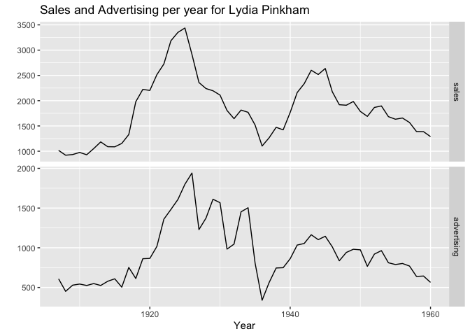

Homework 7: Univariate Time Series Analysis
================
Carlos Siri
4/4/2021

## Lydia Pinkham

*For both Advertising and Sales Determine the best possible ARIMA
model.*

We are presented with sales and avertising time series data spread
annually from 1907 to 1960.

``` r
summary(df1)
```

    ##      Trend            Year          Sales       Advertising    
    ##  Min.   : 1.00   Min.   :1907   Min.   : 921   Min.   : 339.0  
    ##  1st Qu.:14.25   1st Qu.:1920   1st Qu.:1344   1st Qu.: 619.5  
    ##  Median :27.50   Median :1934   Median :1778   Median : 862.0  
    ##  Mean   :27.50   Mean   :1934   Mean   :1829   Mean   : 934.5  
    ##  3rd Qu.:40.75   3rd Qu.:1947   3rd Qu.:2201   3rd Qu.:1090.0  
    ##  Max.   :54.00   Max.   :1960   Max.   :3438   Max.   :1941.0

``` r
sales <- ts(df1$Sales, start = 1907) #convert sales to time series data
advertising <- ts(df1$Advertising, start = 1907) #convert advertising to time series data
cbind(sales,
      advertising) %>%
  autoplot(facets=TRUE) +
  xlab("Year") + ylab("") +
  ggtitle("Sales and Advertising per year for Lydia Pinkham")
```

<!-- -->

The plots seem to be relatively correlated, with an initial increase in
sales and advertising for the first 30 years, followed by a a drop of
about 10 years. Both of the plot increase have a steady increase for 10
years, and are followed by a steady decrease thereafter.

The auto.arima function in the forecast package in R is used to estimate
the models for *sales* and *advertising* below.

``` r
auto_sales <- auto.arima(sales, seasonal=FALSE)
auto_sales
```

    ## Series: sales 
    ## ARIMA(2,0,0) with non-zero mean 
    ## 
    ## Coefficients:
    ##          ar1      ar2       mean
    ##       1.3718  -0.4737  1738.7843
    ## s.e.  0.1171   0.1195   254.8003
    ## 
    ## sigma^2 estimated as 42688:  log likelihood=-364.21
    ## AIC=736.41   AICc=737.23   BIC=744.37

``` r
auto_advertising<- auto.arima(advertising, seasonal=FALSE)
auto_advertising
```

    ## Series: advertising 
    ## ARIMA(1,0,1) with non-zero mean 
    ## 
    ## Coefficients:
    ##          ar1     ma1      mean
    ##       0.7158  0.3320  903.5071
    ## s.e.  0.1103  0.1519  124.1358
    ## 
    ## sigma^2 estimated as 43689:  log likelihood=-364.2
    ## AIC=736.4   AICc=737.22   BIC=744.36

The fuction generated the following estimates \* *sales*: ARIMA(2,0,0)
\* *advertising*: ARIMA(1,0,1)

Anything automatic is dangerous. Lets try it manually.

At first sight, the trends for both plots seem to be statistically
stationary. This can be confirmed with a Unit Root Test

``` r
sales %>% ur.kpss() %>% summary() #stationary could also use ndiffs(sales) to find the proper number of differences
```

    ## 
    ## ####################### 
    ## # KPSS Unit Root Test # 
    ## ####################### 
    ## 
    ## Test is of type: mu with 3 lags. 
    ## 
    ## Value of test-statistic is: 0.1794 
    ## 
    ## Critical value for a significance level of: 
    ##                 10pct  5pct 2.5pct  1pct
    ## critical values 0.347 0.463  0.574 0.739

``` r
advertising %>% ur.kpss() %>% summary()
```

    ## 
    ## ####################### 
    ## # KPSS Unit Root Test # 
    ## ####################### 
    ## 
    ## Test is of type: mu with 3 lags. 
    ## 
    ## Value of test-statistic is: 0.2121 
    ## 
    ## Critical value for a significance level of: 
    ##                 10pct  5pct 2.5pct  1pct
    ## critical values 0.347 0.463  0.574 0.739

The unit root tests confirm the stationarity of the data, thus there is
no need to difference the data. The next section estimates the Sales
ARIMA model manually.

### Sales

The plots below show that the ACF plot dies out and that there are
spikes at *p=2* lags. The first model we can try is an ARIMA(2,0,0)

``` r
ggAcf(sales) + ggtitle("ACF of Sales") # acf of sales
```

<!-- -->

``` r
ggPacf(sales) + ggtitle("PACF of Sales") # pacf of sales
```

<!-- -->

``` r
(fit2 <- Arima(sales, order=c(2,0,0)))
```

    ## Series: sales 
    ## ARIMA(2,0,0) with non-zero mean 
    ## 
    ## Coefficients:
    ##          ar1      ar2       mean
    ##       1.3718  -0.4737  1738.7843
    ## s.e.  0.1171   0.1195   254.8003
    ## 
    ## sigma^2 estimated as 42688:  log likelihood=-364.21
    ## AIC=736.41   AICc=737.23   BIC=744.37

``` r
checkresiduals(fit2)
```

<!-- -->

    ## 
    ##  Ljung-Box test
    ## 
    ## data:  Residuals from ARIMA(2,0,0) with non-zero mean
    ## Q* = 6.9593, df = 7, p-value = 0.4331
    ## 
    ## Model df: 3.   Total lags used: 10

``` r
ggPacf(fit2$residuals) + ggtitle("PACF of ARIMA(2,0,0) residuals")
```

<!-- -->

The ACF and PACF plots remain within the confidence interval, except for
lag-13 (one of the lags outside the confidence interval is within the
margin of error)

### Advertising

``` r
ggAcf(advertising) + ggtitle("ACF of Advertising") # acf of advertising
```

<!-- -->

``` r
ggPacf(advertising) + ggtitle("PACF of Advertising") # pacf of advertising
```

<!-- -->

ACF seems to be dying out and there is a spike at *p=1* lags. We can
start with an ARIMA(1,0,0) model

``` r
(fit3 <- Arima(advertising, order=c(1,0,0)))
```

    ## Series: advertising 
    ## ARIMA(1,0,0) with non-zero mean 
    ## 
    ## Coefficients:
    ##          ar1      mean
    ##       0.8224  883.6361
    ## s.e.  0.0747  149.5104
    ## 
    ## sigma^2 estimated as 45306:  log likelihood=-365.64
    ## AIC=737.28   AICc=737.76   BIC=743.25

``` r
checkresiduals(fit3)
```

<!-- -->

    ## 
    ##  Ljung-Box test
    ## 
    ## data:  Residuals from ARIMA(1,0,0) with non-zero mean
    ## Q* = 28.417, df = 8, p-value = 0.0004011
    ## 
    ## Model df: 2.   Total lags used: 10

``` r
ggPacf(fit3$residuals) + ggtitle("PACF of ARIMA(1,0,0) residuals")
```

<!-- -->

There is a spike at *q=2* lags in the ACF plot. We can try an
ARIMA(1,0,2) model

``` r
(fit4 <- Arima(advertising, order=c(1,0,2)))
```

    ## Series: advertising 
    ## ARIMA(1,0,2) with non-zero mean 
    ## 
    ## Coefficients:
    ##          ar1     ma1      ma2      mean
    ##       0.8480  0.1172  -0.1889  878.0911
    ## s.e.  0.1042  0.1766   0.1391  157.0358
    ## 
    ## sigma^2 estimated as 43568:  log likelihood=-363.61
    ## AIC=737.21   AICc=738.46   BIC=747.16

``` r
checkresiduals(fit4)
```

<!-- -->

    ## 
    ##  Ljung-Box test
    ## 
    ## data:  Residuals from ARIMA(1,0,2) with non-zero mean
    ## Q* = 18.368, df = 6, p-value = 0.005376
    ## 
    ## Model df: 4.   Total lags used: 10

``` r
ggPacf(fit4$residuals) + ggtitle("PACF of ARIMA(1,0,2) residuals")
```

<!-- -->

The auto-ARIMA estimated an ARIMA(1,0,1) with an AIC of 736.4. The
automatic fuction was better in this case.

## PL shares

For 8 product categories you find time-varying information for private
label shares in different countries. For each separate category do a
panel unit root test and explore different panel root options.

The following sections test the unit root hypothesis for the eight
product categories provided.

### Air Care

The Air Care variable is stationary

``` r
library(plm)
library(dplyr)
```

    ## 
    ## Attaching package: 'dplyr'

    ## The following objects are masked from 'package:plm':
    ## 
    ##     between, lag, lead

    ## The following objects are masked from 'package:stats':
    ## 
    ##     filter, lag

    ## The following objects are masked from 'package:base':
    ## 
    ##     intersect, setdiff, setequal, union

``` r
Air_Care <- df2 %>% filter(categories == "Air Care")
Air_Care <- data.frame(split(Air_Care$plshare, Air_Care$Geographies))
purtest(Air_Care , pmax = 3, exo = "none", test = "madwu")
```

    ## 
    ##  Maddala-Wu Unit-Root Test (ex. var.: None)
    ## 
    ## data:  Air_Care
    ## chisq = 145.91, df = 92, p-value = 0.0002958
    ## alternative hypothesis: stationarity

``` r
purtest(Air_Care , pmax = 3, exo = "intercept", test = "madwu")
```

    ## 
    ##  Maddala-Wu Unit-Root Test (ex. var.: Individual Intercepts)
    ## 
    ## data:  Air_Care
    ## chisq = 282.03, df = 92, p-value < 2.2e-16
    ## alternative hypothesis: stationarity

``` r
purtest(Air_Care , pmax = 3, exo = "trend", test = "madwu")
```

    ## 
    ##  Maddala-Wu Unit-Root Test (ex. var.: Individual Intercepts and Trend)
    ## 
    ## data:  Air_Care
    ## chisq = 646.18, df = 92, p-value < 2.2e-16
    ## alternative hypothesis: stationarity

### Bath and Shower

NA’s not allowed

### Breakfast Cereals

When no exogenous variables are introduced, the Breakfast and Cereals
variable is non-stationary.

``` r
B_C <- df2 %>% filter(categories == "Breakfast Cereals")
B_C <- data.frame(split(B_C$plshare, B_C$Geographies))
purtest(B_C , pmax = 3, exo = "none", test = "madwu")
```

    ## 
    ##  Maddala-Wu Unit-Root Test (ex. var.: None)
    ## 
    ## data:  B_C
    ## chisq = 62.931, df = 104, p-value = 0.9995
    ## alternative hypothesis: stationarity

``` r
purtest(B_C , pmax = 3, exo = "intercept", test = "madwu")
```

    ## 
    ##  Maddala-Wu Unit-Root Test (ex. var.: Individual Intercepts)
    ## 
    ## data:  B_C
    ## chisq = 449.51, df = 104, p-value < 2.2e-16
    ## alternative hypothesis: stationarity

``` r
purtest(B_C , pmax = 3, exo = "trend", test = "madwu")
```

    ## 
    ##  Maddala-Wu Unit-Root Test (ex. var.: Individual Intercepts and Trend)
    ## 
    ## data:  B_C
    ## chisq = 1417.6, df = 104, p-value < 2.2e-16
    ## alternative hypothesis: stationarity

### Deodorants

The Deodorants variable is stationary

``` r
D <- df2 %>% filter(categories == "Deodorants")
D <- data.frame(split(D$plshare, D$Geographies))
purtest(D , pmax = 3, exo = "none", test = "madwu")
```

    ## 
    ##  Maddala-Wu Unit-Root Test (ex. var.: None)
    ## 
    ## data:  D
    ## chisq = 141.87, df = 74, p-value = 3.545e-06
    ## alternative hypothesis: stationarity

``` r
purtest(D , pmax = 3, exo = "intercept", test = "madwu")
```

    ## 
    ##  Maddala-Wu Unit-Root Test (ex. var.: Individual Intercepts)
    ## 
    ## data:  D
    ## chisq = 540.78, df = 74, p-value < 2.2e-16
    ## alternative hypothesis: stationarity

``` r
purtest(D , pmax = 3, exo = "trend", test = "madwu")
```

    ## 
    ##  Maddala-Wu Unit-Root Test (ex. var.: Individual Intercepts and Trend)
    ## 
    ## data:  D
    ## chisq = 873.36, df = 74, p-value < 2.2e-16
    ## alternative hypothesis: stationarity

### Ice Cream

When no exogenous variables are introduced, The Ice Cream variable is
non-stationary. pmax was changed to 2 for intercept and trend to avoid
the following error: Error in .urcval(arg = q\[i\], nobs = n.sample, niv
= 1, itt = itt, itv = itv, : NA/NaN/Inf in foreign function call (arg 6)

``` r
I <- df2 %>% filter(categories == "Ice Cream")
I <- data.frame(split(I$plshare, I$Geographies))
purtest(I , pmax = 3, exo = "none", test = "madwu")
```

    ## 
    ##  Maddala-Wu Unit-Root Test (ex. var.: None)
    ## 
    ## data:  I
    ## chisq = 113.84, df = 96, p-value = 0.1034
    ## alternative hypothesis: stationarity

``` r
purtest(I , pmax = 2, exo = "intercept", test = "madwu")
```

    ## 
    ##  Maddala-Wu Unit-Root Test (ex. var.: Individual Intercepts)
    ## 
    ## data:  I
    ## chisq = 380.87, df = 96, p-value < 2.2e-16
    ## alternative hypothesis: stationarity

``` r
purtest(I , pmax = 2, exo = "trend", test = "madwu")
```

    ## 
    ##  Maddala-Wu Unit-Root Test (ex. var.: Individual Intercepts and Trend)
    ## 
    ## data:  I
    ## chisq = 512.11, df = 96, p-value < 2.2e-16
    ## alternative hypothesis: stationarity

### Pasta

When no exogenous variables are introduced, The Pasta variable is
non-stationary.

``` r
P <- df2 %>% filter(categories == "Pasta")
P <- data.frame(split(P$plshare, P$Geographies))
purtest(P , pmax = 3, exo = "none", test = "madwu")
```

    ## 
    ##  Maddala-Wu Unit-Root Test (ex. var.: None)
    ## 
    ## data:  P
    ## chisq = 109.46, df = 122, p-value = 0.7849
    ## alternative hypothesis: stationarity

``` r
purtest(P , pmax = 3, exo = "intercept", test = "madwu")
```

    ## 
    ##  Maddala-Wu Unit-Root Test (ex. var.: Individual Intercepts)
    ## 
    ## data:  P
    ## chisq = 829.01, df = 122, p-value < 2.2e-16
    ## alternative hypothesis: stationarity

``` r
purtest(P , pmax = 3, exo = "trend", test = "madwu")
```

    ## 
    ##  Maddala-Wu Unit-Root Test (ex. var.: Individual Intercepts and Trend)
    ## 
    ## data:  P
    ## chisq = 1110.3, df = 122, p-value < 2.2e-16
    ## alternative hypothesis: stationarity

### Skin Care

I was not able to run more than one lag. With one lag, skin care is not
stationary when individual intercepts are included as exogenous
variables.

``` r
S <- df2 %>% filter(categories == "Skin Care")
S  <- data.frame(split(S$plshare, S$Geographies))
purtest(S , pmax = 1, exo = "none", test = "madwu")
```

    ## 
    ##  Maddala-Wu Unit-Root Test (ex. var.: None)
    ## 
    ## data:  S
    ## chisq = 61.754, df = 96, p-value = 0.9974
    ## alternative hypothesis: stationarity

``` r
purtest(S , pmax = 1, exo = "intercept", test = "madwu")
```

    ## 
    ##  Maddala-Wu Unit-Root Test (ex. var.: Individual Intercepts)
    ## 
    ## data:  S
    ## chisq = 107.48, df = 96, p-value = 0.199
    ## alternative hypothesis: stationarity

``` r
purtest(S , pmax = 1, exo = "trend", test = "madwu")
```

    ## 
    ##  Maddala-Wu Unit-Root Test (ex. var.: Individual Intercepts and Trend)
    ## 
    ## data:  S
    ## chisq = 134.34, df = 96, p-value = 0.005984
    ## alternative hypothesis: stationarity

### Snack Bars

When no exogenous variables are introduced, The “Snack Bars” variable is
non-stationary.

``` r
SB <- df2 %>% filter(categories == "Snack Bars")
SB <- data.frame(split(SB$plshare, SB$Geographies))
purtest(SB , pmax = 3, exo = "none", test = "madwu")
```

    ## 
    ##  Maddala-Wu Unit-Root Test (ex. var.: None)
    ## 
    ## data:  SB
    ## chisq = 27.489, df = 66, p-value = 1
    ## alternative hypothesis: stationarity

``` r
purtest(SB , pmax = 3, exo = "intercept", test = "madwu")
```

    ## 
    ##  Maddala-Wu Unit-Root Test (ex. var.: Individual Intercepts)
    ## 
    ## data:  SB
    ## chisq = 230.92, df = 66, p-value < 2.2e-16
    ## alternative hypothesis: stationarity

``` r
purtest(SB , pmax = 3, exo = "trend", test = "madwu")
```

    ## 
    ##  Maddala-Wu Unit-Root Test (ex. var.: Individual Intercepts and Trend)
    ## 
    ## data:  SB
    ## chisq = 282.16, df = 66, p-value < 2.2e-16
    ## alternative hypothesis: stationarity
